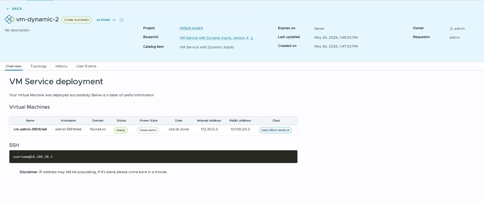

# VM Service with User Inputs & Overview Blueprint

This advanced blueprint deploys a Virtual Machine with cloud-init configuration, an optional Load Balancer, and generates a custom deployment overview.

**Format Version:** 2

**Resources Provisioned:**
- `CCI.Supervisor.Namespace`: Connects to an existing namespace.
- `CCI.Supervisor.Resource`: Provisions a Virtual Machine.
- `CCI.Supervisor.Resource`: Conditionally provisions a VirtualMachineService (Load Balancer).
- `CCI.Supervisor.Resource`: Provisions a Secret (cloud-config).

**Inputs:**
- **Select Namespace** (`namespace-name`)
- **Select Virtual Machine Size** (`vm-class`)
- **Select Virtual Machine Image** (`vm-image`)
- **Assign public IP** (`expose-ssh`)

## Blueprint Overview

